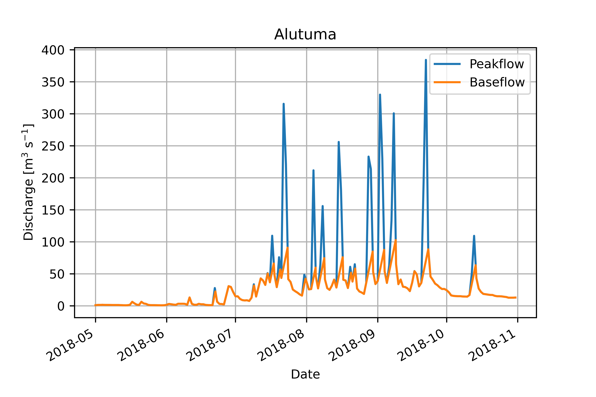

# Hydrograph-Baseflow-Separation

## Hydrograph-py

Hydrograph-py is a hydrological Python package that provides some tools for:

• Separation of flow time-series into peak flow and baseflow.
• Filtering of peak flow events given a minimum event duration.
• Calculation of peak event volumes.
• Calculation of maximum annual peak flow and maximum annual peak event volume.
• Extreme value analysis using GEV fitting and plotting functions.

Streamflow separation in this package is based on the principle introduced by. They separated
the hydrograph into “quickflow” and “delayed flow” components by arbitrarily projecting a line of
constant slope from the beginning of any stream rise until it intersected the falling side of the
hydrograph.

## Area of Focus - Alutuma (Station) 

In this study, the Alutuma catchment, a sub-basin of the Brahmani river basin in Odisha, was
selected as the study area. The total catchment area is 1332 km2 , with a perimeter of 270.40
km. It lies between east longitude 85 20′ to 86° 45′ and north latitude 20° 50′ to 21° 20′.
Alutuma is a small Village/hamlet in Harichandanpur Tehsil in Kendujhar District of Odisha State,
India. It is located 75 KM towards South from District head quarters Kendujhar. 27 KM from
Harichandanpur. 114 KM from State capital Bhubaneswar.

